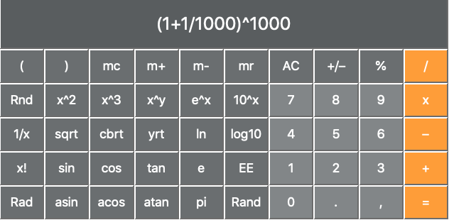

# Simple Calculator
Implementation of a calculator with basic functions. Inspired as a continuation of the [last challange](https://www.hackerrank.com/challenges/js10-binary-calculator?hr_b=1) of [Hackerrank's 10 days of Javascript](https://www.hackerrank.com/domains/tutorials/10-days-of-javascript). The design of the calculator is based on the one present in OS X systems.

    

